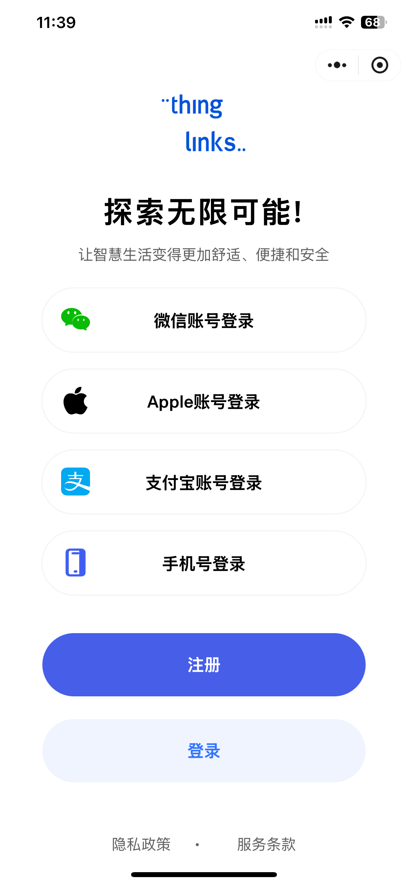
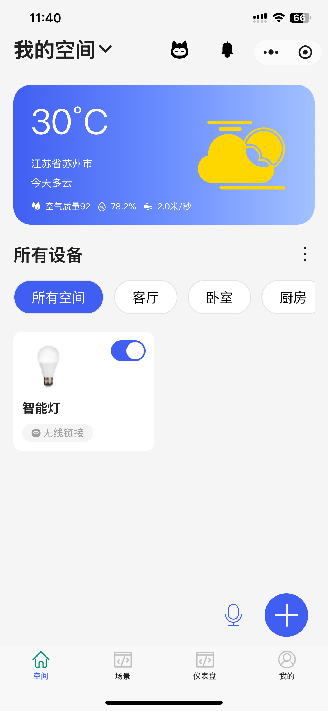
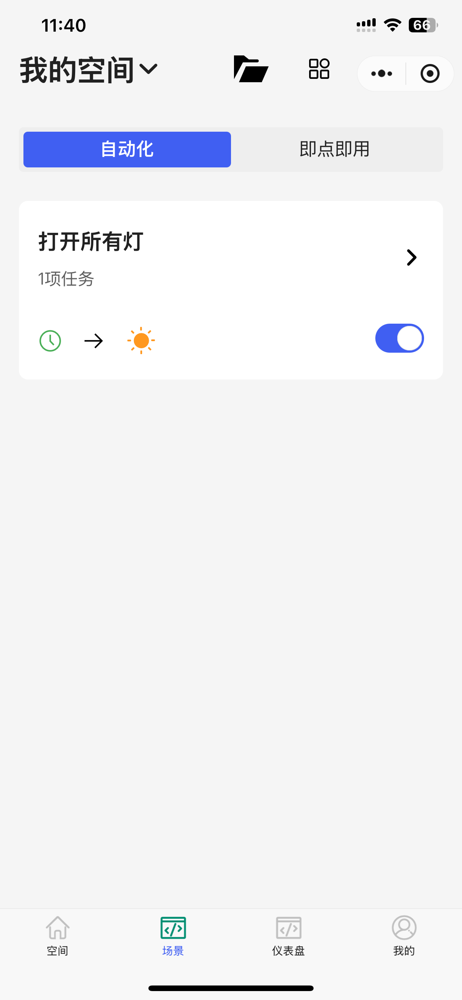
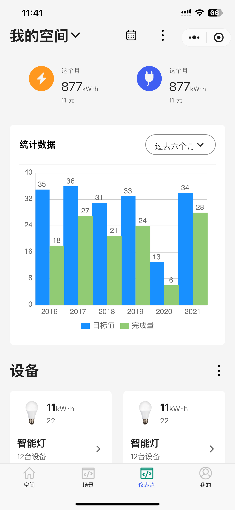
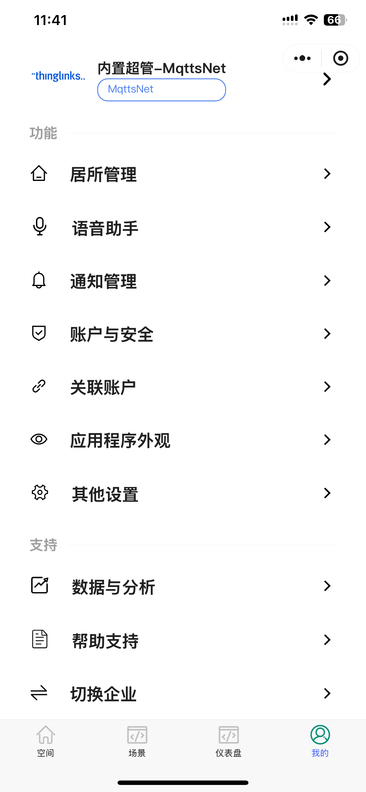

<h1 align="center" style="margin: 30px 0 30px; font-weight: bold;">ThingLinks Mobile</h1>
<h4 align="center">Lightweight mobile ThingLinks developed based on UniApp</h4>

	

## ThingLinks | [English Documentation](README.md)

## Platform Overview

The ThingLinks APP, built on the UniApp framework, allows one codebase to adapt to multiple terminals, supporting APP, mini-programs, and H5! It provides a mobile solution that perfectly integrates with the [ThingLinks platform](https://github.com/mqttsnet/thinglinks). Currently, it has implemented basic functionalities such as login, my account, dashboard, profile editing, avatar modification, password change, frequently asked questions, and about us.

This is the best UniApp development framework constructed using UniApp + Vue3 + Ts + Vite4 + UnoCss + VSCode (or optionally WebStorm) + Uni plugins + Wot-UI (other UI libraries can also be used). It integrates various tools and technologies, utilizing the latest frontend tech stack, and can run web, mini-programs, and APP through the command line without relying on HBuilderX. (Note: HBuilderX is still required for the App.)

UniBest includes built-in features such as conventional routing, layout management, request encapsulation, request interception, login interception, UnoCSS, i18n multilingual support, etc., providing code suggestions, automatic formatting, unified configuration, and code snippets to enhance your UniApp development experience.

* [ThingLinks Official Documentation](https://www.mqttsnet.com)
* Accompanying backend code repository address [ThingLinks](https://github.com/mqttsnet/thinglinks).
* The application framework is based on [UniApp](https://uniapp.dcloud.net.cn/), supporting mini-programs, H5, Android, and iOS.
* Frontend components are based on [Wot-UI](https://wot-design-uni.netlify.app/), a high-performance UI framework compatible with all platforms.

## Demo Screenshots

### Login Interface

### Space Display

### Scene Display

### Dashboard

### Personal Center

## Development Notes
1. **File Path**: Place code in the `pages` directory, organized into different folders by module. A `tabbar` folder has been created to start with the styles for the four tabs.

2. **Image Path**: Store images in the `static` folder, organized into different folders by module (folders can be created as needed). For example, files for the space page should be in the `static/images/space` folder. If there are subpages, create subfolders accordingly (e.g., `static/images/space/xxx`).

3. **Component Path**: Components should be placed in the `components` folder, organized into different folders by module (folders can be created as needed). For example, files for the space page should be in the `components/space` folder.

**Currently, this is the initial framework. If you encounter issues or missing features, feel free to add modifications, just be sure to write good comments or note them when submitting.** Other framework-related documentation can be referenced from [uni-best](https://codercup.github.io/unibest-docs/), and for syntax-related issues, refer to the Uni-App documentation.

## Issues (We welcome your valuable feedback)

[issues](https://github.com/mqttsnet/thinglinks-mobile/issues)

## Pull Requests Welcome

[pr->feat/contrbute](https://github.com/mqttsnet/thinglinks-mobile/pulls)

## License (Open Source License)

[Apache License, Version 2.0](LICENSE)

[Thanks to JetBrains for providing free IDEA License](https://www.jetbrains.com)

## Copyright Usage Instructions

The ThingLinks open-source platform follows the [Apache License, Version 2.0](LICENSE) agreement. Commercial use is allowed, but please retain author and copyright information.
